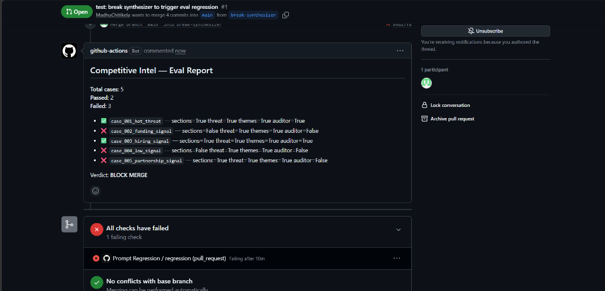

# Competitive Intel Agents

Multi-agent competitive intelligence system with self-auditing harness, built with LangGraph and FastMCP, and wired to [prompt-regression-mcp](https://github.com/MadhuChitikela/prompt-regression-mcp).

## Eval-driven development

Every PR runs the golden eval suite. If any case regresses, the PR is blocked.



The harness (`evals/harness.py`) combines:
- **Structural checks** — required sections present (Executive Summary, Threats, Opportunities, Recommendations)
- **Deterministic checks** — threat scores meet expected floor
- **LLM-as-judge** — brief reflects expected themes (uses `prompt-regression-mcp`'s `grade()`)

This project is a reference implementation for [prompt-regression-mcp](https://github.com/MadhuChitikela/prompt-regression-mcp).

---

## Architecture: 4-Agent LangGraph

```
                 +--------------+
                 |    Scout     |  (fetch_competitor_news, check_job_postings)
                 +-------+------+
                         |
                         v
                 +-------+------+
                 |   Analyst    |  (LLM categorization + score_threat)
                 +-------+------+
                         |
                         v
  +------------> +-------+------+
  |              | Synthesizer  |  (Markdown intelligence brief generation)
  |              +-------+------+
  |                      |
  |                      v
  |              +-------+------+
  +- (Retry < 2) |   Auditor    |  (audit_brief heuristic & rubric evaluation)
                 +-------+------+
                         |
                         +---> [PASS / End]
```

### The 4 Agents
1. **Scout (`app/agents/scout.py`):** Gathers raw competitive intelligence via FastMCP tools.
2. **Analyst (`app/agents/analyst.py`):** Categorizes signals into strategic categories and scores threat impact.
3. **Synthesizer (`app/agents/synthesizer.py`):** Drafts a structured weekly intelligence brief with citations and concrete recommendations. If an audit fails, it incorporates the auditor's specific critique and regenerates.
4. **Auditor (`app/agents/auditor.py`):** Evaluates the brief against a rigorous 4-part rubric (structure, evidence, actionability, conciseness) and drives the retry loop.

Every agent logs full telemetry (prompt inputs, completions, latencies, and tool calls) directly to P1's trace database.

---

## 5 FastMCP Tools

Exposed via FastMCP and mounted on FastAPI at `/mcp`:
1. `fetch_competitor_news`: News signals with deterministic deduplication across runs.
2. `scrape_pricing_page`: Competitor tier and pricing extraction.
3. `check_job_postings`: Hiring signals to spot strategic team shifts.
4. `score_threat`: Deterministic 0–100 signal threat scoring.
5. `audit_brief`: Self-auditing rubric evaluation that inspects structure, citation density, action verbs, and length.

---

## Quickstart

```powershell
# 1. Activate venv
.\.venv\Scripts\activate

# 2. Run unit & integration tests (19 tests)
pytest tests/ -v

# 3. Start server
python -m app.main

# 4. Run end-to-end pipeline
python scripts/run_pipeline.py "Acme Corp"
```
